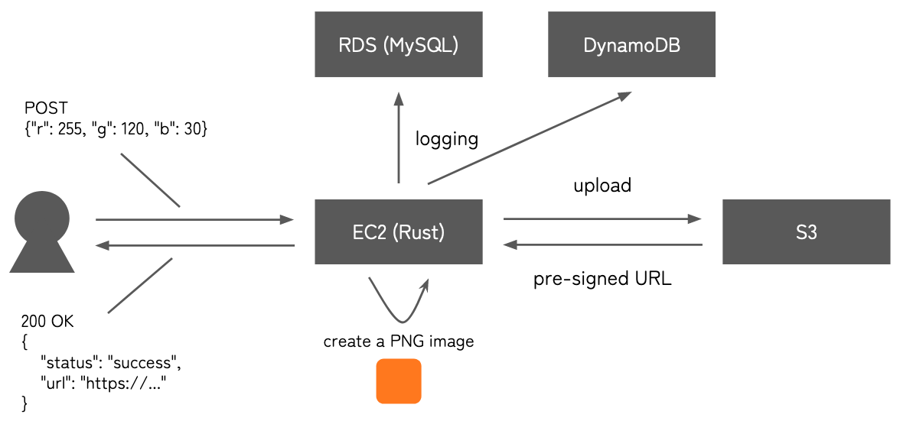
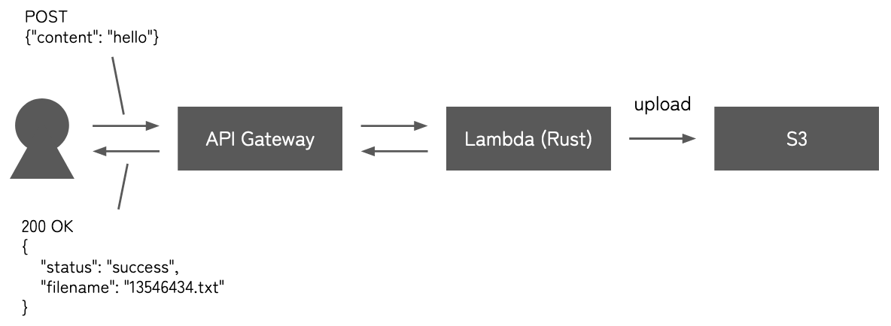

# 1. About

Sample Rust projects to access AWS via SDK.

# 2. Prerequisites

- `~/.aws/credentials` (This can be created via `aws configure` command.)

- [`cargo-lambda`](https://github.com/awslabs/aws-lambda-rust-runtime)

# 3. `./ec2` project

## 3.1 About

This project creates an HTTP server which does the following for each request:

1. Receive a JSON of the form `{"r": 255, "g": 255, "b": 0}`.

2. Create a PNG image whose every pixel is filled with the given color.

3. Upload it to S3.

4. Log the request with its timestamp to RDS (MySQL) and DynamoDB.

5. Create and return a pre-signed URL (i.e. a public URL with expiration date) to access the object uploaded in S3.

It works locally, or you can deploy it to EC2.

## 3.2 Architecture



<!-- https://docs.google.com/presentation/d/1ITQbn7CoCnWI3O8fwQH6-TurLOHx4iAe2oX_AM6DeRE/edit#slide=id.g21f1d234fe4_0_23 -->

## 3.3 Usage

1. Access [*S3 console*](https://s3.console.aws.amazon.com/s3/buckets?region=ap-northeast-1) to create a bucket called `bucket-test-002-a` with the default settings.

2. Access [*RDS console*](https://ap-northeast-1.console.aws.amazon.com/rds/home?region=ap-northeast-1).

    1. Create a MySQL instance called `test-rds-001`. Make sure `Publicly accessible` is turned on (to test it locally). 

    2. Edit inbound rules to allow accesses to `3306` port.

    3. Connect to it via command-line to create a database called `test`.

        ```bash
        #You can NOT use a space instead of `=`.
        $ mysql -h <host> -P 3306 --user=<user> --password=<password>
        ```

        ```
        create database test;
        ```

3. Access [*DynamoDB console*](https://ap-northeast-1.console.aws.amazon.com/dynamodbv2/home?region=ap-northeast-1#service) to create a table called `test_dynamodb_001`, whose primary key has the name `timestamp` of the type `String`.

4. Access [*EC2 console*](https://ap-northeast-1.console.aws.amazon.com/ec2/home?region=ap-northeast-1#Home).

    1. Create an instance whose OS is Amazon Linux 2.

    2. Edit inbound rules to allow accesses to the port you want to listen (in addition to SSH).

5. Deploy and build the project.

    1. Connect to the instance via SSH.
        ```bash
        $ ssh aws
        ```

    2. Install Rust by following [the official instructions](https://www.rust-lang.org/tools/install):
        ```bash
        $ curl --proto '=https' --tlsv1.2 -sSf https://sh.rustup.rs | sh
        ```

    3. Install dependencies.
        ```bash
        $ sudo yum update
        $ sudo yum install git gcc openssl-devel
        ```

    4. Clone this repository.
        ```bash
        $ git clone 'https://github.com/your-diary/aws_rust_samples'
        ```
    
    5. Edit the configuration file (see below for the details).
        ```bash
        $ cd aws_rust_samples/ec2
        $ vi config.json
        ```
    
    6. Build.
        ```bash
        $ cargo build --release
        ```

    7. Run.

        TODO

6. Call the API.

    TODO

    ```bash
    $ curl \
        -d '{"r": 100, "g": 100, "b": 200}' \
        <URL>
    ```

    ```json
    {"status":"success","url":"https://..."}
    ```

    ```bash
    $ curl <returned URL> | imgcat
    ```

## 3.4 Configurations

Configurations are read from `config.json`.

Example:

```json
{
    "port": 30021,
    "img_width": 300,
    "img_height": 200,
    "s3": {
        "bucket_name": "bucket-test-002-a",
        "expiration_sec": 30
    },
    "rds": {
        "host": "test-rds-001.xyz.ap-northeast-1.rds.amazonaws.com",
        "port": 3306,
        "user": "admin",
        "password": "abcde",
        "database_name": "test",
        "table_name": "colors"
    },
    "dynamodb": {
        "table_name": "test_dynamodb_001"
    }
}
```

## 3.5 References

- [*`aws-sdk-rust/examples/` - GitHub*](https://github.com/awslabs/aws-sdk-rust/tree/main/examples)

# 4. `./lambda/` project

## 4.1 About

This project creates a REST API which receives a JSON of the form `{"content": <string>}` and uploads its `content` as `<timestamp>.txt` to S3.

## 4.2 Architecture



## 4.3 Usage

1. Run tests. We expect every test passes.

    ```bash
    $ cargo test
    ```

2. Cross-compile the project for Amazon Linux 2.

    ```bash
    $ cargo lambda build --release
    ```

3. Deploy the project as a lambda function. You **do not** have to create a lambda function from the console in advance; it automatically creates or updates the lambda function whose name is `lambda_test_001`. (The name can be customized via `name` property in `Cargo.toml`).

    ```bash
    $ cargo lambda deploy
    ```

4. Access [*S3 console*](https://s3.console.aws.amazon.com/s3/buckets?region=ap-northeast-1) to create a bucket called `bucket-test-001-a` with the default settings.

5. Access [*Lambda console*](https://ap-northeast-1.console.aws.amazon.com/lambda/home?region=ap-northeast-1#/functions).

    1. Select `lambda_test_001`.

    2. Select `Configuration` > `Permissions` > `Execution role` and click the name of the role (e.g. `cargo-lambda-role-...`).

    3. Add `AmazonS3FullAccess` role.

6. Access [*API Gateway console*](https://ap-northeast-1.console.aws.amazon.com/apigateway/main/apis?region=ap-northeast-1).

    1. Create a new REST API called `test_gateway_001`.

    2. Select `Actions` > `Create Method` to create a `POST` method and bind it to `lambda_test_001`.

    3. After creating the `POST` method, click `Method Request` and change the value of `API Key Required` to `true`.

    4. Select `Actions` > `Deploy API` to deploy the API. The name of a stage is arbitrary but let's use `testing` for convenience. After that, you are redirected to `Stage Editor`. Change the values of `Rate` and `Burst` as you want. You may also want to memorize the `Invoke URL` which is the URL for this API.

    5. Select `Usage Plans` in the sidebar to start creating a usage plan called `Testing`. First set `Rate`, `Burst` and `Quota` as you want, and then click `Add API Stage` to bind the `testing` stage of `test_gateway_001` to the plan.

    6. Select `API Keys` in the sidebar and select `Actions` > `Create API key` to create an API key. Then click `Add to Usage Plan` to bind it to the `Testing` plan.

7. Call the API with the key.

    ```bash
    $ curl \
        -H 'x-api-key: <API key>' \
        -d '{"content": "hello"}' \
        <URL>
    ```

    ```json
    {"status":"success","filename":"1678969418940.txt"}
    ```

## 4.4 References

- [*Using the AWS SDK for Rust in AWS Lambda function*](https://docs.aws.amazon.com/sdk-for-rust/latest/dg/lambda.html) (a bit outdated)

- [*`lambda_runtime` crate*](https://docs.rs/lambda_runtime/latest/lambda_runtime/index.html)

<!-- vim: set spell: -->

